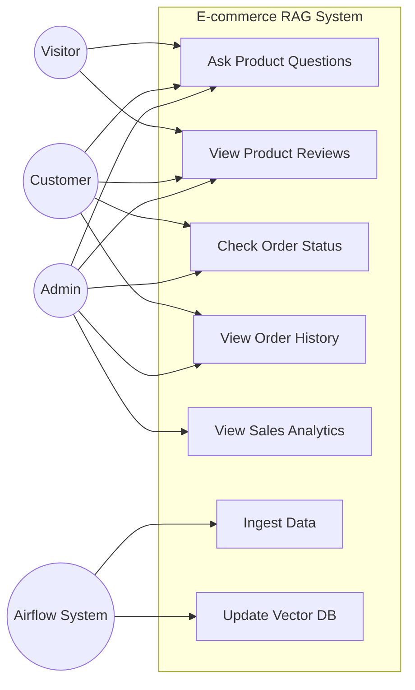
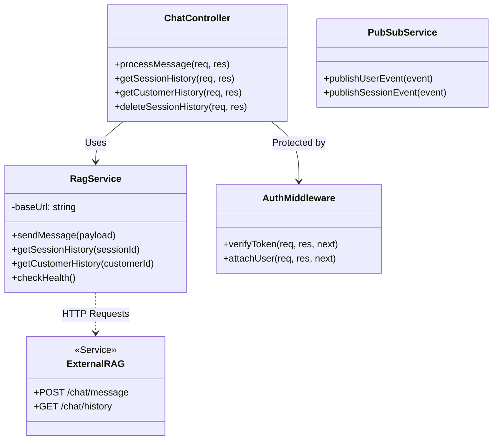
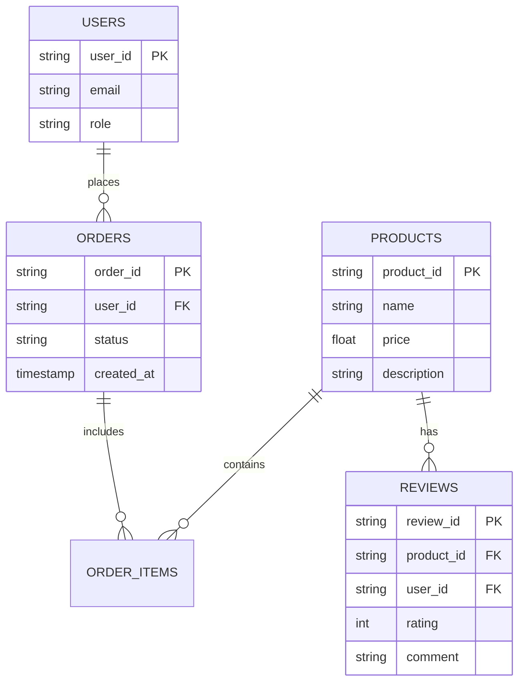
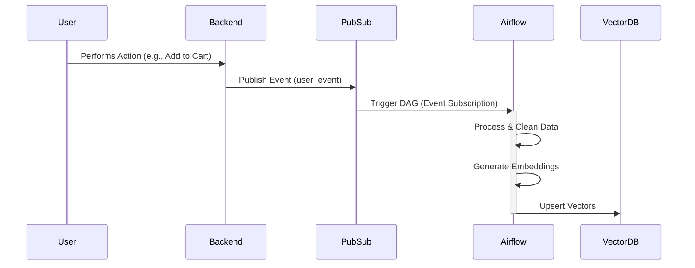
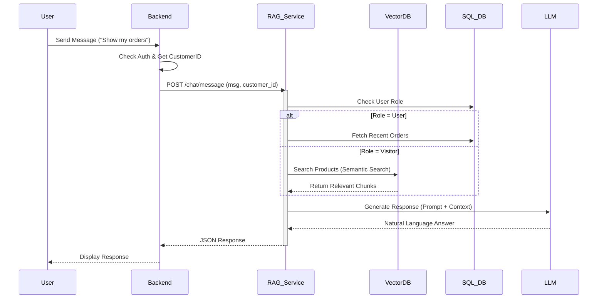
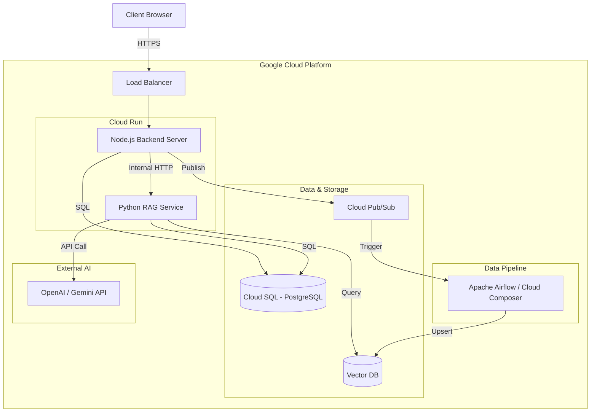

# System Design Document (SDD) & Software Requirements Specification (SRS)

## 1. Introduction

### 1.1 Project Scope
The **E-commerce RAG Chatbot** is an intelligent conversational agent designed to enhance the user experience on an e-commerce platform. It leverages **Retrieval-Augmented Generation (RAG)** to provide accurate, context-aware responses by retrieving relevant product information, reviews, and user order history from a vector database and a relational database. The system includes a data processing pipeline powered by **Apache Airflow** to ingest and embed data, and a backend service deployed on **Google Cloud Run** to handle user queries and coordinate with the AI models.

### 1.2 Definitions & Acronyms
-   **RAG (Retrieval-Augmented Generation):** A technique that optimizes the output of an LLM, so it references an authoritative knowledge base outside its training data before generating a response.
-   **DAG (Directed Acyclic Graph):** A collection of all the tasks you want to run, organized in a way that reflects their relationships and dependencies. Used in Airflow.
-   **LLM (Large Language Model):** AI models like GPT-4 or Gemini used for generating natural language responses.
-   **Vector DB:** A database optimized for storing and querying vector embeddings (e.g., Pinecone, Milvus, pgvector).
-   **Pub/Sub:** Google Cloud Pub/Sub, a messaging service for exchanging event data between applications and services.

### 1.3 High-Level Architecture
The system consists of three main pillars:
1.  **Frontend (Client):** A React-based web application where users interact with the chatbot.
2.  **Backend (Server):** A Node.js/Express service acting as an API gateway, handling authentication, and routing chat requests to the RAG service. It also publishes user events to Pub/Sub.
3.  **RAG Service:** A specialized service (likely Python-based) that performs vector searches, context retrieval, and LLM generation.
4.  **Data Pipeline:** An Airflow-based ETL pipeline that consumes events from Pub/Sub and updates the Vector DB with new product data and user interactions.

---

## 2. Software Requirements Specification (SRS)

### 2.1 Functional Requirements

#### 2.1.1 Data Pipeline (Airflow)
-   **Ingestion:** The system must ingest real-time user events (view_product, add_to_cart, purchase) and product updates via Google Cloud Pub/Sub.
-   **Chunking:** Text data (product descriptions, reviews) must be split into manageable chunks to optimize embedding quality.
-   **Embedding:** The system must generate vector embeddings for text chunks using an embedding model (e.g., OpenAI text-embedding-3 or Gemini Embedding).
-   **Storage:** Embeddings and metadata must be upserted into the Vector Database.
-   **Scheduling:** DAGs must run on defined schedules (e.g., daily for full sync) or be triggered by specific events.

#### 2.1.2 RAG Service
-   **Query Handling:** The service must accept natural language queries from the Backend API.
-   **Role-Based Access:**
    -   **Visitor:** Access to public product data and reviews only.
    -   **User:** Access to personal order history and public data.
    -   **Admin:** Full access to all data, including sales analytics and inventory.
-   **Retrieval:** The system must perform semantic search against the Vector DB to find relevant context.
-   **Generation:** The system must construct a prompt with the retrieved context and user query, send it to the LLM, and return the generated response.
-   **History Management:** The system must store and retrieve chat history for sessions and users.

### 2.2 Non-Functional Requirements
-   **Performance:** Chat responses should be generated within 2-5 seconds.
-   **Scalability:** The system must support horizontal scaling (Cloud Run instances) to handle increased load (up to 800 concurrent requests).
-   **Security:**
    -   RAG Service must be internal-only (no public ingress).
    -   All API communications must be encrypted (HTTPS).
    -   Role-based access control (RBAC) must be strictly enforced.
-   **Reliability:** The system should have a 99.9% uptime.
-   **Maintainability:** Code should be modular, with clear separation between the API layer, business logic, and data access.

---

## 3. System Analysis (Use Case View)

### 3.1 Actors
-   **Visitor:** Unauthenticated user browsing the site.
-   **Customer (User):** Authenticated user with an account.
-   **Admin:** System administrator or store manager.
-   **Airflow System:** Automated scheduler for data pipelines.
-   **RAG Service:** The AI component processing queries.

### 3.2 Use Case Diagram

### 3.3 Main Scenarios

#### Scenario 1: Customer Asks about Order Status
1.  **User** logs in and opens the chat widget.
2.  **User** types "Where is my order #123?".
3.  **Backend** identifies the user and sends the query + `customer_id` to **RAG Service**.
4.  **RAG Service** detects "User Mode" and retrieves order details from the Relational DB.
5.  **RAG Service** generates a response: "Order #123 is currently in transit..."
6.  **User** receives the response.

#### Scenario 2: Admin Asks for Sales Analytics
1.  **Admin** logs in and accesses the Admin Chat.
2.  **Admin** asks "What are the top selling products this month?".
3.  **Backend** sends query + `customer_id` (Admin Role) to **RAG Service**.
4.  **RAG Service** detects "Admin Mode", queries the Sales/Order tables for analytics.
5.  **RAG Service** generates a summary report.
6.  **Admin** receives the report.

---

## 4. System Design (Structural View)

### 4.1 Class/Module Design
The following diagram illustrates the relationship between the Backend Server components and the integration with the external RAG Service.

### 4.2 Database Schema

#### 4.2.1 Relational Database (PostgreSQL)
Stores structured data: Users, Products, Orders, Reviews.

#### 4.2.2 Vector Database Schema
Stores embeddings for semantic search.

| Collection | Fields | Description |
| :--- | :--- | :--- |
| **products** | `id` (string) | Product ID |
| | `vector` (float[]) | Embedding of name + description |
| | `metadata` (json) | `{ "name": "...", "category": "...", "price": 100 }` |
| **reviews** | `id` (string) | Review ID |
| | `vector` (float[]) | Embedding of review comment |
| | `metadata` (json) | `{ "product_id": "...", "rating": 5 }` |

---

## 5. Behavioral View (Sequence & Activity)

### 5.1 Sequence Diagram - Data Ingestion
This flow shows how user actions are captured and processed into the Vector DB.

### 5.2 Sequence Diagram - Retrieval & Generation
This flow shows how a user query is processed by the RAG system.

---

## 6. Deployment & Infrastructure

### 6.1 Infrastructure Diagram
The system is deployed on Google Cloud Platform (GCP).

